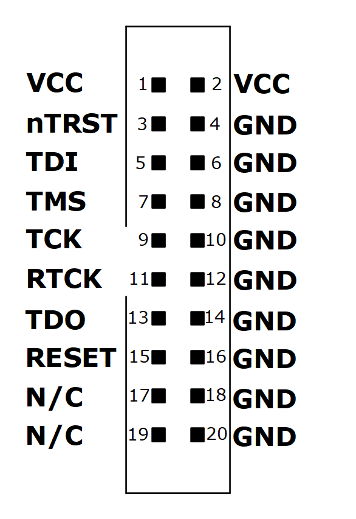

## Getting started
Everything here is for Linux systems, specifically Ubuntu 20.01. Download the following tools: 
- [J-link](https://www.segger.com/downloads/jlink/). Get the *.deb file for Linux and execute ```sudo dpkg -i JLink_Linux_V764_x86_64```. The file name may be something else depending on what version you are using. 
- Unzip the Downloaded [FreedomStdio](https://www.sifive.com/software). This is the IDE we will use for the FE310 projects. 


FE310 Hardware setup
--------------------------------
Connecting J-link:
- Follow the j-link pin configuration and connect jumpers/wires to the [JTAG pins](https://github.com/mwelling/lofive/wiki#installing-lofive-enabled-freedom-e-sdk) of the FE310. 

- JTAG Vref goes to  *+3.3Vout* line of the FE310 board
- RTCK does not need to connect to the board. It is *TCLK* that matters for now.
- Connect a power supply to the +5V line.
- The board does not have any LED or any power indicator, so let us connect an LED to GPI0-5/SPI1.SCK. 
- Connect the J-link to your system (with the software you set up previously) and type ```JLinkExe -AutoConnect 1 -Device FE310 -If JTAG -Speed 4000 -jtagconf -1,-1```. This should connect the board to J-link software. Type ```halt```  to see the CPU status, e.g., register values. If you are at this stage, the system is ready for programming
- Flashing light. The start.hex is a binary to blink LED (GPIO-5). If you have connected everything correctly, just execute ```source blink.sh``` from ./FE310 directory. Do you see blinking LED?
-----------------------------------------

FreedomStd
---------------------
1. Navigate to the folder and run the executable in a shell ```./FreedomStudio```.  If you do not run this with root access you might get an error because it tries to create a workspace in the root directory. Just ignore those :warning: and choose a folder wherever you want.
2. FE310 directory has a Freedom project---blinky---that should work right out of the box. Just hit  'debug' (the bug-looking icon like all other eclipes-based IDE). If you hit the resume button, the MCU should blink. 
 


Measuring execution time
------------------------

1. AES_test in FE310 directory is a project for FreedomStudio, and it measures clock ticks elapsed in 200 iterations of tes_encrypt() or test_decrypt() [line 201]. The result is stored in the SRAM's 0x80000000 at the end of the execution.
2. load this project's executable in the device and run ```python3.8 get_time``` from ./FE310/cpu_cycle_counter/. Note, wait a few seconds before running the time calculator*. 

| Method | Encryption | Decryption | Size (bytes) | Current |
|--------|------------|------------|--------------|---------|
| Scope  | 10.2ms     | 31.43ms    |         28452* | 19mA   |
| Timer  | 10.19ms     | 31.49ms    |              |         |

*Freedom metal library is responsible for most of it. Just do -o1 at compilation; you will see a huge change (~75%) in the code size.

**The clock used in the measurement is a 1MHz source that is used in standard clock() function. Note that there is an inter-device frequency variation, which depends on the trim-level set up at the manufacturing time. Unless you explicitly set up the frequency, there should be some variations in the measured data. 
For comparison, you can hook a scope in GPIO-5 to see the toggles; the pulse width is the execution time of 200 iterations.

FAQ
-------------------
1. FreedomStd is not running the code
Launch the debugger from the project explorer window (left most window) and right-click to find *Debug As* or *Run As*. For there go to *Debug configuration*  and click *Debug*. This will happen if you erased the bootloader, and if this is the case, the CPU will never run on its own even if there is code in the Flash. A good solution is to recover the bootloader. Follow instruction in this repo: [recover](https://github.com/riscv-rust/hifive1-recover).

2. Erasing the full chip. Connect JLinkExe, Halt the CPU and execute ```exec EnableEraseAllFlashBanks``` then ```erase```. The entire Flash will be erased.
3. ```mem32 0x20000000, 10``` this command reads 10 words from the flash. Flash's base address is 0x20000000. ```Wreg pc, 0x20000000``` point the PC to execute flash code. You can load binary images dynamically (```loadFile ./Executable_1.bin, 0x80000000``` in the SRAM.) 
4. This device has no internal Flash. but the board has 128Mbit QSPI.
5.  Power supply is internally routed from the 5V header. so do not worry about that.
6. 16MHz crystal in the board.