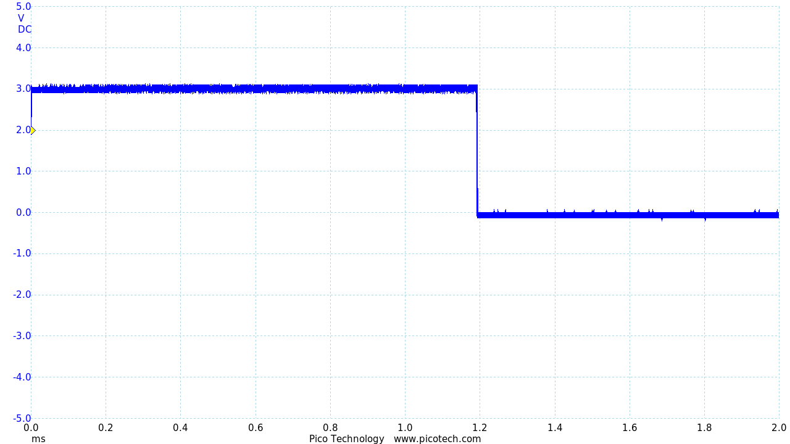

# EnergyHarvestingDeviceTestbed

|Device|ISA|Default Clock (MHz)|SRAM (KB)|NVM (KB)|Dev. Enivronment|DMIPS/MHz|Coremark/MHz|Purchase Link|
|---|---|---|---|---|---|---|---|---|
|MSP430G2553IN20|MSP430 (Flash)|1|0.5|16|Great| |1.11|https://www.digikey.com/en/products/detail/texas-instruments/MSP-EXP430G2ET/9608004?s=N4IgTCBcDaILYGcAOAWAzABgAQHMwFMAXEAXQF8g|
|MSP430FR5994|MSP430X (FRAM)|1|8|256|Great| |1.11|https://www.ti.com/tool/MSP-EXP430FR5994?utm_source=google&utm_medium=cpc&utm_campaign=epd-msp-430-prodfolderdynamic-cpc-pf-google-wwe&utm_content=prodfolddynamic&ds_k=DYNAMIC+SEARCH+ADS&DCM=yes&gclid=Cj0KCQjwvO2IBhCzARIsALw3ASqUf7gxsO9rVTdfKJMEaIDoS4b-fNDCS6sCe2KYl0S6dPbcUmKdx_waAjakEALw_wcB&gclsrc=aw.ds|
|Adafruit METRO M0 (ATSAMD21G18)|ARM Cortex-m0+ (v6m)|48|32|256|Bad|0.95|2.46|https://www.adafruit.com/product/3505|
|MSP432|ARM Cortex-m4F (v7m)|3|64|256|Great|1.27|3.42|https://www.ti.com/tool/MSP-EXP432P401R?utm_source=google&utm_medium=cpc&utm_campaign=epd-null-null-OPN_EN-cpc-evm-google-wwe&utm_content=Device_ToolFolder&ds_k=MSP-EXP432P401R&DCM=yes&gclid=Cj0KCQjwvO2IBhCzARIsALw3ASpg2iltfqWzDLmrjK7SnvtKGD9A2jZRPM57xBkQBrc4LCYNG_xSahUaAihEEALw_wcB&gclsrc=aw.ds|
|Apollo 3 Blue|ARM Cortex-m4F (v7m) (subthreshold)|48|384|1024|Bad|1.27|3.42|https://www.digikey.com/en/products/detail/sparkfun-electronics/DEV-15170/9962475?s=N4IgjCBcoLQBxVAYygMwIYBsDOBTANCAPZQDa4ArAGwIC6AvvYQExkgAiAogGoxgVgA7AAYQDIA|
|SAML11 UFO Target|ARM Cortex-m23 (v8m)|32|16|64|Good|0.98|2.64|https://www.mouser.com/datasheet/2/894/NAE-CW308T-ATSAML11_datasheet-1601385.pdf|
|LoFive R1|RV32IMAC|16|16|16384|Good|1.61|2.73|https://store.groupgets.com/products/lofive-risc-v|

## MSP432

Install Texas Instruments Code Composer Studio: https://www.ti.com/tool/CCSTUDIO

## MSP430

Install Texas Instruments Code Composer Studio: https://www.ti.com/tool/CCSTUDIO

## Apollo3 Blue
Aside from the actual Sparkfun Edge development board (https://www.sparkfun.com/products/15170), you need a CH340C serial to USB adapter (https://www.sparkfun.com/products/15096).

## Adafruit METRO M0 Express
1. Install [Arduino IDE](https://www.arduino.cc/en/software) 
2. [Set up board](https://learn.adafruit.com/adafruit-metro-m0-express/using-with-arduino-ide)
3. Change the name of the file containing the main function to be the same with the directory and change the extension to (ex: If the name of the directory is test, and the main file is main.c, then change the file name from main.c to test.ino)
4. Change the name of the main function to void loop()
5. Run the code and get the execution time from the [serial monitor](https://docs.arduino.cc/software/ide-v2/tutorials/ide-v2-serial-monitor) in Arduino IDE

Resons for using Arduino IDE
- Arduino CLI does not support Serial as of now (May 11 2022)
- Arduino extension for VS Code has glitches when running Serial (May 11 2022)

### Running AES
First, download the Ambiq Suite SDK for developing on Sparkfun Ambiq boards.
```
git clone --recursive https://github.com/sparkfun/AmbiqSuiteSDK
```

Next download and apply the serial adapter driver update.
```
git clone https://github.com/juliagoda/CH341SER.git
cd CH341SER
make
sudo make load
```

Next, navigate to the project directory for AES on the Apollo board:
```
cd aes/apollo/gcc
```

You are now ready to flash the AES program to the Apollo board.
Connect the serial-to-usb adapter to the PC and the Apollo board to the adapter.
Note that **you must run the make command as sudo** (because this command is going to flash the board) and **you must press down button 14 on the Edge board during programming** (to use the bootloader).
The format of the make command will vary depending on your installation. Generally:
```
sudo make BOARDPATH=<Ambiq SDK Location>/boards_sfe/edge COM_PORT=<The USB port the adapter is connected to> ASB_UPLOAD_BAUD=921600 SDKPATH=<Ambiq SDK Location> COMMONPATH=<Ambiq SDK Location>/boards_sfe/common bootload_asb
```
As an example, my complete make command is:
```
sudo make BOARDPATH=/home/harrison/AmbiqSuiteSDK/boards_sfe/edge COM_PORT=/dev/ttyUSB0 ASB_UPLOAD_BAUD=921600 SDKPATH=/home/harrison/AmbiqSuiteSDK COMMONPATH=/home/harrison/AmbiqSuiteSDK/boards_sfe/common bootload_asb
```

After programming, press the RST button on the Edge board. The green LED (labelled 44 on the silkscreen) should light up, indicating that the AES encryption succesfully completed.

### Measuring execution time
The provided test code includes two ways to measure AES execution time.
The primary way is through an on-chip 3MHz hardware timer, the result of which is output over UART.
Alternatively, the code also toggles GPIOs to be measured by an oscilloscope for timing the AES execution.

#### Timer
Connect the device to a UART terminal with 115200 baud rate, 8 data bits, no parity, and 1 stop bit.
Reset the device to re-execute the AES execution.
The device will output the execution time in micro-seconds over UART.

#### Oscilloscope
Probe pin 1 (labelled on the silkscreen) and reset the device to re-execute the AES execution.
Before AES encryption, the pin is cleared.
Then, the pin is set immediately before the AES encryption and cleared immediately after.
Below is an example of the expected waveform for AES192.

